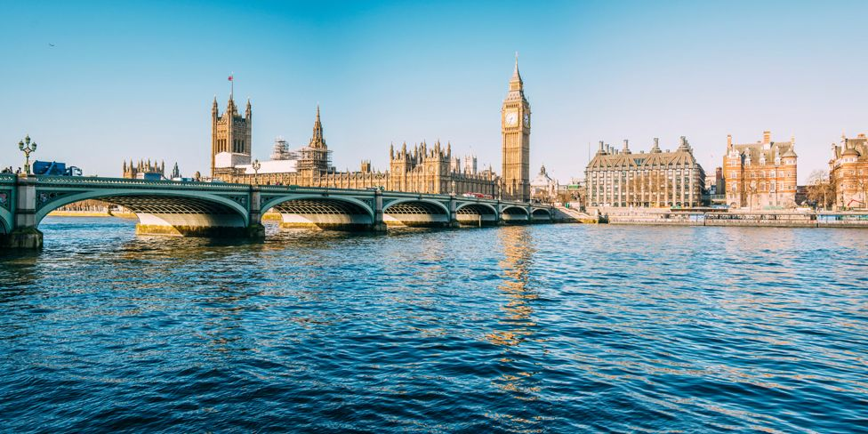
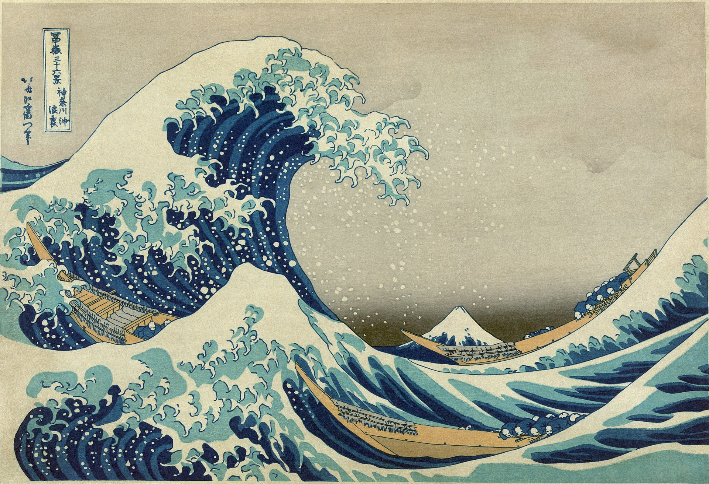

# Danger! Work in progress!

# About me
# 

## Overview of projects

## 1. Deep Learning

### Neural Style Transfer
    

This app was based on an assignment in the Coursera deep learning specialization on convolutional networks. The neural network outputs activations are a series of  which takes a series of activations 

The code is available [here](https://github.com/stuarthaze/StyleTransferApp)

