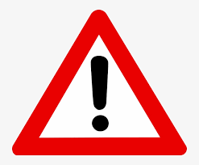

<!--  Danger! Work in progress! -->

# Introduction
***
<table>
  <tr>
    <td>  </td>
    <td>Welcome to my portfolio. This is an eclectic selection of data science projects that I have been working on, some of which I developed in academia, some adapted from studying machine learning, and others just out of interest.
    </td>
  </tr>
</table>

***
# Deep Learning
***
### Neural Style-Transfer App
[Link -> Github repository](https://github.com/stuarthaze/StyleTransferApp)
This app was based on an assignment in the Coursera deep learning specialization. It uses a pre-trained VGG-19 convolutional neural network to merge the content of one image with the style of a second image. Gradient descent is used to optimize the pixels of the generated image. 

 

The app was built using streamlit and allows the user to modify the hyper parameters such as the ratio of content:style, learning rate and number of training epochs.
 
***
# Statistics
***
### Sweets selection

Does this distribution represent an expected outcome of randomly selected sweets?  
   

Find out more below:
[Link -> Project page](https://stuarthaze.github.io/Quality_Street)
