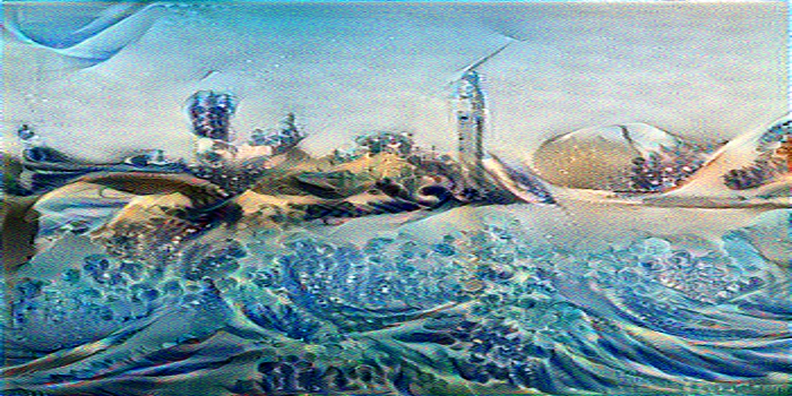

# Danger! Work in progress!

# About me

## Overview of projects
***
## Deep Learning
### Neural Style-Transfer App
    

This app was based on an assignment in the Coursera deep learning specialization. It uses a pre-trained VGG-19 convolutional neural network to merge the content of one image with the style of a second image. Gradient descent is used to optimize the pixels of the generated image. The app was built using streamlit.

The code is available [here](https://github.com/stuarthaze/StyleTransferApp)

***
## Statistics
### Sweets selection
Does this distribution represent an expected outcome of randomly selected sweets?
  
The problem is explained here: [Project page](https://stuarthaze.github.io/Quality_Street)
